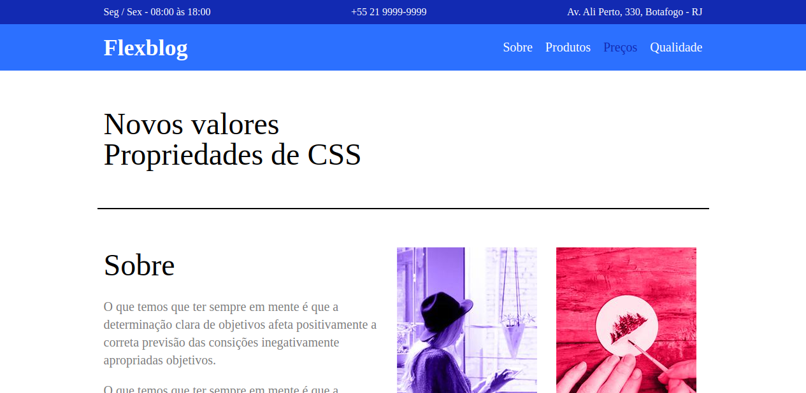
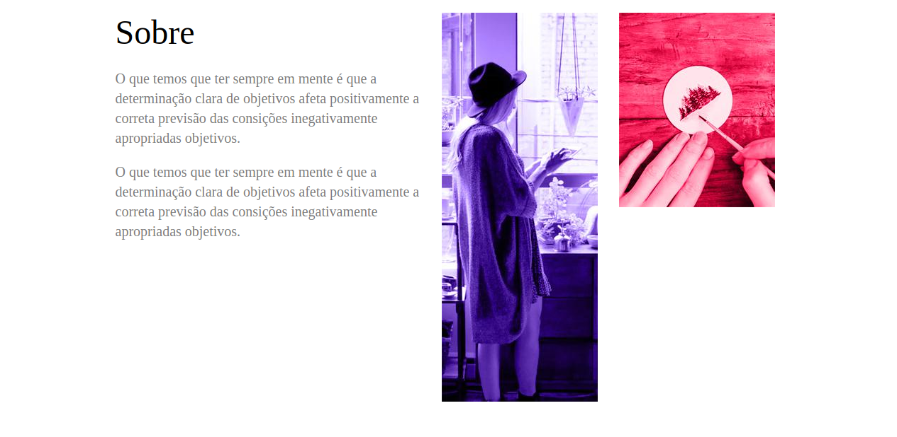
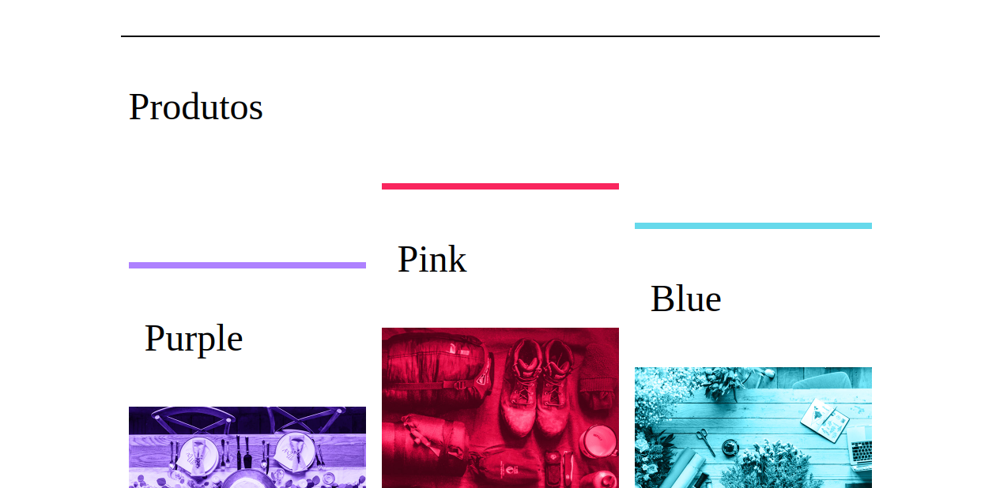

# flexblog

## Sobre o projeto :information_source:

Esse projeto foi desenvolvido no curso de CSS flexbox da origamid com intuito de 
colocar em prática todo o conteúdo visto no curso.

---

## Tecnologias :wrench:

As tecnologias usadas foram:

- HTML
- CSS 

---

## Preview :computer:

Acesse a página: [**Aluracord-tho-te-ocean**](https://aluracord-tho-te-ocean.vercel.app)

<video src="./img/FlexBlog.mp4"></video>

